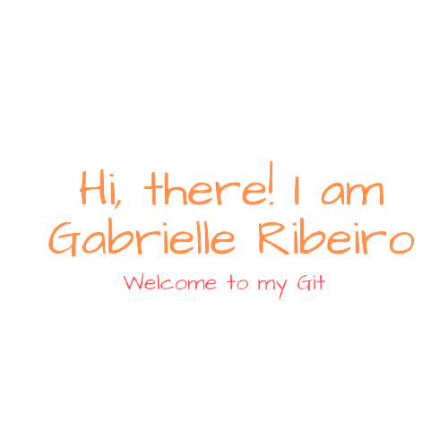

  

## &nbsp;***About me***

I am an undergraduate technology student at Centro Universitário Farias Brito currently in my second year. My technical stack involve Javascript, HTML, CSS. I love to learn and build something new, productive, innovative and creative.

- 🔥 **I am interested in Web development**
- 🌱 I’m currently learning ...
  - React Native
  - NodeJs
  
- 👯 I’m looking forward to collaborate on open source projects.
- ✔ Ask me about anything, I am happy to help! 
- 🥳 Outside tech, 😼 I love cats, 🚴 pedaling, 🎵 listen to music, and ✈️ travel.
- 📫 You can contact me via email ribeirogabrielle19@gmail.com

